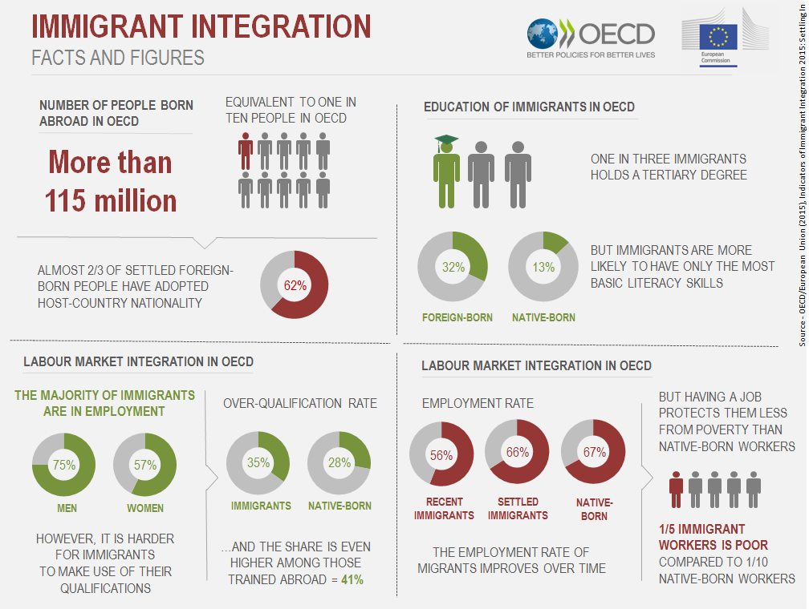

```{r setup, include=FALSE}
knitr::opts_chunk$set(echo = FALSE, cache = FALSE, message = FALSE, warning = FALSE)

# Libraries
library(tidyverse)
library(readr)
library(kableExtra)
library(bookdown)
library(countrycode)
library(tinytex)
library(scales)
library(naniar)
library(bookdown)
library(knitr)
library(visdat)
```

\section*{Acknowledgement}

Our sincere gratitude goes out to Dr.Patricia Menéndez and the tutors; Stephanie Kobakian, Mark Dulhunty and Pablo Montero Manso for their guidance and support during the semester. Their culminative efforts have put us in a position where we are able to collaboratively produce this report while demonstrating our ability to use git tools.

\pagebreak


\section*{Abstract}

There is no doubt that globalization is here to stay and that it continues to intensify and to reshape our identities and living spaces. **Migration** is one important factor that enhances globalization and helps in cultural and socio-economic changes in a large scale. This report will focus on a few aspects of migration. 

\section*{Introduction}

Migration is the movement of people from one place to another with the intentions of settling permanently or temporarily at a new location. With increased globalization, easy acess to opportunities across the world and increased educational and skill levels of individuals, migration has become a common occurence across the world.

The impact of migration is an important factor affecting both the home country and the destination country of the migrant. The impact however varies by the reason of migration. Labor migration, skill based migration, migration for education, marriage migration and migration of refugees are a few categories of migration based on the reason for migration.

Within the context of this report, the migration statistics in the years 2015 and 2016 will be analysed based on demographic factors of the migrants, their education and skill levels, preference of countries to migrate to and the type of occupations they are most likely to migrate for. The analysis will compare countries, continents and population within countries in deriving conclusions.





\section*{Data Sources}

The Organisation for Economic Co-operation and Development(OECD) provides a dataset based on the population censuses of OECD countries around the world. The OECD  and the World Bank also collaborate in providing an [extensive dataset on the immigrants from OECD countries to non-OECD countries](http://www.oecd.org/els/mig/dioc.htm).

The dataset from the database of Immigrants in OECD and non-OECD countries from the year 2015-2016 will be used in the analysis within the report. The dataset includes information such as demographic characteristics of the immigrants, their duration stay, labor market outcomes, fields of study, educational attainment and their place of birth.

Along with the dataset, the OECD provides documentation on the methodology used in obtaining the data and a description of limiations in the methodology. The metadata also contains a detailed explanation of the spread of data over several files, the encoded variables, the domain of each variable and reasons for missing values in specific variables

The OECD makes data available for use and consultation by the public under the license **CC BY-NC-SA 3.0 IGO**. This license allows us to share and modify data apart from commercial uses and has strict restrictions of attribution.

A few important definitions required to understand this report are mentioned below.

What is OECD ?

The Organisation for Economic Co-operation and Development (OECD) is a group of 34 member countries that discuss and develop economic and social policy. OECD members are democratic countries that support free-market economies

What is ISCED ?

The International Standard Classification of Education is a statistical framework for organizing information on education maintained by the United Nations Educational, Scientific and Cultural Organization. It is a member of the international family of economic and social classifications of the United Nations.

What is ISCO ?

The International Standard Classification of Occupations is an International Labor Organization classification structure for organizing information on labor and jobs.

\subsection*{Limitations of the dataset}

The Database on Immigrants in OECD Countries (DIOC) 2015/16 provides information on age,duration of stay, labour force status and occupation of the migrants. The limitations of the dataset is as follows,

\begin{enumerate}

   \item Confidentiality and Reliability issues 

Due to confidentiality issues, the place of birth is recorded at the continental level such as Africa, Asia, Europe, etc.instead of the country level in the dataset,therefore the analysis is focused on only the destination countries.Also,there is only limited details available on the important variables like educational qualification and skills. 

   \item Unavailability of data

Unavailability of data on variables like age, skills,occupation ,labour force status and educational qualification proved to be a limitation to the analysis of the dataset.

  \item  Inconsistency of data
 
 The dataset contains inconsistency in data for example the reference population for Switzerland, Luxembourg and New Zealand is 15+ and there is no information on the age group 0-14. Due to this reason and the fact that 0-14 age group belongs to the minor category, the age group 0-14  was not considered for the analysis of gender gap in migrant population.  
 
\end{enumerate}


\section*{Research Ethics}

Dataset used in the report for analysis, has a lot of unknown values due to confidentiality issues and the methods used to ensure reliability and protect confidentiality. Major principles of research ethics have been used in this report no labels or absurd statements have been made keeping in mind obtain informed consent from potential research participants, minimize the risk of harm to participants, protect their anonymity and confidentiality, avoid using deceptive practices and give participants the right to privacy.

\section*{Methodology}

Every migrant analyzes a few factors of the destination country before actually settling permanently or temporarily. Some of the factors are which are the best destination countries, what are the job opportunities, what is the unemployment rate, what is the level of education and their recognition worldwide, and similar many other factors. But our report is a live dataset from the past years and shows true analysis of what is the current situation of migration across the globe and particularly about Australia as well. Since our dataset is large and contains many files this report only focuses on  four research questions, giving all of us a gist about the state of migration and migrants, across the world.


\pagebreak


\section*{Research Questions}

There research question we have aimed to answer are as follows: 

- The top destinations for migration, the gender difference in migration in total and across different age groups
- Identifying the relationship between unemployment and education level as well as the gender gap in unemployment
- Analyzing the level of education of residents of Australia versus the duration they have been in Australia.
- Distribution of various skill levels, types of occupation and overqualified population across the globe in different continents


\pagebreak


\section*{Migration and Gender Gap}

```{r dataread , echo=FALSE, message=FALSE}
file1 <- read.csv("data/DIOC_2015_16_File_A_1.csv")
```

Throughout history, humans have migrated for various reasons that could be classified as economic, social, political, etc. This section focuses on the preferred destination countries for migration as well as the gender difference across age groups in the migrant population in destination countries.

```{r datacleaning , echo = FALSE, message = FALSE}
whomigrates<- file1 %>% 
  mutate(edu_lfs = as.character(edu_lfs),
         age_lfs=as.character(age_lfs),
         sex=as.character(sex),
         national=as.character(national),
         oecd=as.character(oecd),
         oecdb=as.character(oecdb),
         fborn=as.character(fborn)
         ) %>% 
         mutate(
           age_lfs = case_when(
    str_detect(age_lfs,"0") ~ "0-14",
     str_detect(age_lfs,"1") ~ "15-24",
 str_detect(age_lfs,"2") ~ "25-64",
 str_detect(age_lfs,"3") ~ "65+",
 str_detect(age_lfs,"12") ~ "15-84",
 str_detect(age_lfs,"99") ~ "Unknown" 
 )) %>%
  mutate(sex = case_when(
   str_detect(sex,"1") ~ "Male",
   str_detect(sex,"2")~ "Female"
 )) %>%
  mutate(edu_lfs = case_when(
    str_detect(edu_lfs,"1")~"low",
    str_detect(edu_lfs,"2")~"medium",
    str_detect(edu_lfs,"3")~"high",
    str_detect(edu_lfs,"99")~"unknown"
  )) %>% 
      mutate(national = case_when(
    str_detect(national,"0") ~ "Foreigner",
     str_detect(national,"1") ~ "National",
     str_detect(national,"99")~"unknown"
    
  )) %>% mutate(oecd = case_when(
    
    str_detect(oecd,"0") ~ "Non member",
     str_detect(oecd,"1") ~ "Member"
    
  )) %>% mutate(oecdb = case_when(
    
    str_detect(oecdb,"0") ~ "Non member",
     str_detect(oecdb,"1") ~ "Member"
    
  )) %>% mutate(fborn = case_when(
    
    str_detect(fborn,"0") ~ " Native-born",
     str_detect(fborn,"1") ~ " Foreign-born ",
     str_detect(fborn,"99")~"unknown"
    
  )) %>% replace_with_na (replace =
                    list(edu_lfs = "unknown",
                         national = "unknown",
                         fborn = "unknown"
                        ))

```

The table \@ref(tab:topdestinations) depicts the preferred destinations for migration in the year 2015/16. Historically, the USA have been the most popular destination for migration and has remained the same in the year 2015-16, with the most preferred destinations being the USA, Japan, and Mexico across all ages. 

```{r topdestinations, echo = FALSE, message = FALSE, warning=FALSE}

top_10 <- whomigrates %>%  
  mutate(
         sex=as.factor(sex),
         oecd=as.factor(oecd),#oecd resident
         oecdb=as.factor(oecdb),#oecd born
         age_lfs=as.factor(age_lfs),
         edu_lfs =as.factor(edu_lfs)
         ) %>% 
  group_by(country) %>% 
  summarise(Migrant_Count=
              sum(number,na.rm=T)) %>%
  arrange(desc(Migrant_Count)) %>%
  head(10) 
  
  top_10 %>% 
   
    mutate(country =
    case_when(
    str_detect(country,"USA") ~ "United States of America",
    str_detect(country,"JPN") ~ "Japan",
    str_detect(country,"MEX") ~ "Mexico",
    str_detect(country,"DEU") ~ "Germany",
    str_detect(country,"TUR") ~  "Tunisia",
     str_detect(country,"FRA") ~  "France",
     str_detect(country,"GBR") ~  "United Kingdom",
     str_detect(country,"ITA") ~  "Italy",
     str_detect(country,"KOR") ~  "Korea",
     str_detect(country,"ESP") ~  "Spain"
  ))  %>% 
    rename(Country = country) %>%
     kable("latex", 
        booktabs = T,
        caption="Top 10 destinations") %>% 
kable_styling(latex_options= c("striped",
                               "condensed"),
              full_width = F) 

  
  fm <- whomigrates %>% 
  mutate(
         sex=as.factor(sex),
         oecd=as.factor(oecd),#oecd resident
         oecdb=as.factor(oecdb),#oecd born
         age_lfs=as.factor(age_lfs)
         ) %>% group_by(sex) %>% 
  summarise(n=sum(number,na.rm = T)) 
 percent<- fm %>% pivot_wider(names_from = sex,values_from = n) %>%
   mutate(pf= (Female/(Female+Male)*100),
             pm=(Male/(Female+Male)*100)
                 )            
```

Among the international migrants, `r round(percent$pf,2)` % are females and `r round(percent$pm,2)` % are males. Figure \@ref(fig:gendergap) shows the gender gap in each country's migrant population and it is observed that in 2015-16, women constituted more in the migrant population especially in the top preferred destinations like the USA, Japan, etc whereas the gap is relatively low in countries like Belgium, Finland, etc. 

```{r gendergap, warning=FALSE,echo = FALSE, message = FALSE, fig.cap="Gender difference in migrant population in countries" , fig.width=10}


                                        

options(scipen=999)
gendergap <- whomigrates %>% 
  mutate(
         sex=as.factor(sex),
         oecd=as.factor(oecd),#oecd resident
         oecdb=as.factor(oecdb),#oecd born
         age_lfs=as.factor(age_lfs)
         ) %>% 
  group_by(sex,country)%>%
  summarise(n=sum(number,na.rm = T)) 
   
  gendergap %>% 
    ggplot(aes(x= fct_reorder(country,n),
               y=n,
               fill= sex) )+
    geom_col(position = "dodge")+ 
    theme_bw()+theme(axis.text.x = element_text(angle = 90, 
                                                hjust = 1)) + 
    scale_y_continuous(labels = comma) +
    xlab("Destination Country") + 
    ylab("Number of Migrants")
    


```

In 2015-16, the most number of migrants fell in the age group 25-64, with females being higher in number compared to males in countries like the USA, Mexico, Germany, etc. In countries like Japan, Korea and Spain it can be seen that there is no gender gap in the migrant population of age group 25-64 whereas in countries like Poland and Turkey the number of males is higher than females for the same age group. 
Amongst the age group 15-24, there is a relatively low gender difference in the migrant population compared to the other age groups and the trend is uniform in almost all the countries whereas amongst the migrants who are 65 years old and above, the number of females is higher than that of males in the USA, Japan , Italy, etc and Mexico being one of the top destinations for migration, saw an influx of an equal number of males and females aged over 65 in the year 2015-16. 


```{r agegap, warning=FALSE,echo = FALSE, message = FALSE, fig.cap="Gender difference in migrant population across age groups in countries " , fig.width=8}

agegap <- whomigrates  %>% 
  mutate(
         sex=as.factor(sex),
         oecd=as.factor(oecd),#oecd resident
         oecdb=as.factor(oecdb),#oecd born
         age_lfs=as.factor(age_lfs)
         ) %>%
 
  group_by(age_lfs,sex,country) %>% 
  summarise(total=sum(number,na.rm = T))
  `%notin%` <- Negate(`%in%`)
 agegap%>%  
  filter(age_lfs %notin% c("0-14","Unknown")) %>%
  ggplot(aes(x = country,y = total,fill = sex)) +

  
    geom_col(position = "dodge")+ 
    theme_bw()+theme(axis.text.x = element_text(angle = 90, hjust = 1)) + 
    scale_colour_brewer(palette = "Set1")+ 
    scale_y_continuous(labels = comma) +
   facet_wrap(~age_lfs,nrow = 3) + ylab("Number of Migrants") +
   xlab("Country") 


```

\pagebreak


\section* {The Education Level of Australian Residents}

```{r reading-data}
fileb1 <- read.csv("data/DIOC_2015_16_File_B_1.csv")
```

```{r}
# missing values (unknown values) represented by 99, were replaced by NA for analysis of dataset
fileb1_missing <- filter(fileb1, country == "AUS") %>%
  replace_with_na(replace =
                    list(edu_lfs = 99,
                         dos_lfs = 99,
                         fborn = 99)
                  )

variable_miss_pct <- miss_var_summary(fileb1_missing) %>%
  mutate(pct_miss = percent(pct_miss/100))


```

```{r cleaning-data}
fileb1cleaned <- fileb1 %>% mutate(
  sex = case_when(
    sex == "1" ~ "male",
    sex == "2"~ "female"
    ),
  edu_lfs = case_when(
    edu_lfs == "1" ~ "low",
    edu_lfs == "2" ~ "medium",
    edu_lfs == "3" ~ "high",
    edu_lfs == "99" ~ "unknown"
  ),
  dos_lfs = case_when(
    dos_lfs == "0" ~ "native-born",
    dos_lfs == "1" ~ "five-years-or-less",
    dos_lfs == "2" ~ "five-to-ten-years",
    dos_lfs == "3" ~ "more-than-ten-years",
    dos_lfs == "23" ~ "more-than-five-years",
    dos_lfs == "99" ~ "unknown",
  ),
  oecd = case_when(
    oecd == "0" ~ "non-member",
    oecd == "1" ~ "member"
  ),
  oecdb = case_when(
    oecdb == "0" ~ "non-member",
    oecdb == "1" ~ "member"
  ),
  fborn = case_when(
    fborn == "0" ~ "native-born",
    fborn == "1" ~ "foreign-born",
    fborn == "99" ~ "unknown"
  )
  )
```

In the past few decades, Australia has acquired many skilled migrants, contributing substantially towards the local economy. @hawthorne2010valuable states that by 2007, two thirds of them were former international students recruited in Australia rather than offshore applicants. This transition has also been named as the _"two-step-migration"_ by @hawthorne2010valuable.

This section will analyse the education levels of current residents of Australia categorized by their duration of stay in the country.

The dataset provides information on the education levels of Australian residents and their duration of stay within the country.  
The residents of Australia have been categorized based on their duration of stay within the country as  

- native born
- less than 5 years
- between 5 - 10 years
- more than 10 years

The level of education has been categorized using a broad three-category classification as  

- low
- medium
- high

However the duration of stay of `r variable_miss_pct %>% filter(variable == "dos_lfs") %>% select(pct_miss)` of Australian residents is unknown, while the education level of `r variable_miss_pct %>% filter(variable == "edu_lfs") %>% select(pct_miss)` residents is unknown. These values will also be used in the analysis as unknowns, to provide a more accurate overlook on the overall numbers.
 

```{r summarise-aus-data}
#filter AUS residents
aus_b1 <- fileb1cleaned %>% filter(country == "AUS") %>%
  group_by(dos_lfs,edu_lfs) %>%
  summarise(count = sum(number))
```


```{r tile-plot-edu-vs-duration, fig.cap="Breakdown of Australian residents based on their level of Education and duration of stay in Australia"}
aus_b1 %>% ggplot(aes(x = dos_lfs,
                     y = edu_lfs)) +
  geom_tile(aes(fill = count)) +
  labs(x = "Duration of Stay",
       y = "Level of Education") +
  theme(axis.text.x = element_text(angle = 45, hjust = 1)) +
  scale_x_discrete(limits = c("five-years-or-less", "five-to-ten-years", "more-than-ten-years", "native-born", "unknown")) +
  scale_y_discrete(limits = c("low", "medium", "high", "unknown")) +
  scale_fill_continuous(labels=comma)
```

Figure \@ref(fig:tile-plot-edu-vs-duration) shows the breakdown of Australian residents based on their duration of stay in Australia and their level of education; the higher counts of residents are represented by light blue and the lower number of residents are represented by dark blue. The dataset contains a few unknowns about the residents, some on the level of education and some on the duration of stay, which is also represented in figure \@ref(fig:tile-plot-edu-vs-duration).

It's obvious that the highest counts of Australian residents are natives, and is interesting that a majority of them have a medium level of education, followed by natives having a higher level of education and only a few of them having a low level of education.
It's also interesting how the numbers of Australian residents who have been in the country for over ten years, shows higher counts of numbers than those who have been in the country for a lower duration of time. It can also be seen that in all three categories of non-native born Australians, most have received a high level of education.


```{r table-percent-levels-of-education}
aus_b1 %>%
  filter(dos_lfs != "unknown") %>%
  pivot_wider(values_from = count,
              names_from = edu_lfs) %>%
  mutate(h_prcnt = percent(high/sum(high+low+medium+unknown)),
         m_prcnt = percent(medium/sum(high+low+medium+unknown)),
         l_prcnt = percent(low/sum(high+low+medium+unknown)),
         u_prcnt = percent(unknown/sum(high+low+medium+unknown))) %>%
  select(-high, -medium, -low, -unknown) %>%
  rename("Duration of stay" = dos_lfs,
         "High level of education (%)" = h_prcnt,
         "Medium level of education (%)" = m_prcnt,
         "Low level of education (%)" = l_prcnt,
         "Unknown level of education (%)" = u_prcnt) %>%
  kable(caption = "Percentages of Australian residents with different levels of education over each category of duration of stay") %>%
  kable_styling(latex_options = c("HOLD_position", "scale_down", "striped", "condensed"))
```

A breakdown of Australian residents with different durations of stay, into their level of education is represented in table \@ref(tab:table-percent-levels-of-education). It can be seen that the majority of individuals who have obtained residency in Australia recently have a high level of education while only a few of them have a low level of education. A significant increase in percentages of individuals with higher levels of education obtaining residency in Australia can also be seen from table \@ref(tab:table-percent-levels-of-education). Most native-Australians (41%) have a medium level of education, while others with shorter durations of stay in Australia have much higher levels of education.

@green2007immigrant states that the immigration policies in Australia has placed an increased focus in skill-based selection criteria, and has resulted in over-education of recently arrived Australian immigrants. This can be attributed to the most of the recent immigrants having a high level of education as represented by figure \@ref(fig:tile-plot-edu-vs-duration) and table \@ref(tab:table-percent-levels-of-education).


\section*{Gender Gap and Education with Unemployment rate}

```{r}
C <- read_csv("data/DIOC_2015_16_File_C_1.csv") %>% rename("labour_force_status" = "lfs", "educational_level" = "edu_lfs")
```

```{r}
C1 <- C %>% mutate(gender = case_when(str_detect(sex, "1") ~ "male",
                         str_detect(sex, "2") ~ "female"))
C2 <- C1 %>% mutate(employment = case_when(str_detect(labour_force_status
, "1") ~ "employed",
                         str_detect(labour_force_status
, "2") ~ "unemployed",
                         str_detect(labour_force_status
, "3")~ "inactive",
                         str_detect(labour_force_status
, "99")~ "unknown"))
```


```{r}
GG <- C2 %>% select(!sex) %>% pivot_wider(names_from = gender, values_from = number) %>% select(country, male, female, employment)
```

```{r}
GGM <- GG %>% group_by(country, employment) %>% summarise(countM = sum(male, na.rm = TRUE)) %>% pivot_wider(names_from = employment, values_from = countM)
```


```{r}
GGM1 <- GGM %>% mutate(unemployrateM = (unemployed/(employed + inactive + unemployed)*100)) %>% select(country,unemployrateM)
```


```{r}
GGF <- GG %>% group_by(country, employment) %>% summarise(countM = sum(female, na.rm = TRUE)) %>% pivot_wider(names_from = employment, values_from = countM)
```

```{r}
GGF1 <- GGF %>% mutate(unemployrateF = (unemployed/(employed + inactive + unemployed))*100) %>% select(country,unemployrateF)
```

```{r unemployment_gendergap}
GGMF <- GGM1 %>% full_join(GGF1, "country") %>% mutate(unemployrateGAP = unemployrateF - unemployrateM)
```

```{r}
GGMF %>% head(10) %>% kable(caption = "unemployment gendergap") %>% kable_styling(latex_options = c("HOLD_position"))
```

```{r GAP, fig.width=11, fig.height=7, fig.cap = "unemployment gender gap", messgae =  FALSE}

GGMF%>% filter(country != "LUX") %>% filter(country!= "KOR") %>%
ggplot(aes(x = unemployrateGAP, y = country, color = country, fill = country)) +  
  geom_col()
```

As is shown in \ref{fig:GAP} , the unemployment rate differences between female and male are negative in most countries.
  We can draw conlusion from  thatGenerally speaking, gender gap in unemployment rate does exist. Surprisingly, the unemployment rate gaps are negative in most country, this means female have lower unemployment rate than male in most countries.

\pagebreak
```{r}
C3 <- C2 %>% mutate(educationlevel = case_when(str_detect(educational_level
, "1") ~ "low",
                         str_detect(educational_level
, "2") ~ "medium",
                         str_detect(educational_level
, "3")~ "high",
                         str_detect(educational_level
, "99")~ "unknown"))

```

```{r}
C4 <-C3 %>% 
  select(!labour_force_status) %>% 
  pivot_wider(names_from = employment, values_from = number) %>%
group_by(country, educationlevel) %>% 
  summarise(employed = sum(employed, na.rm = TRUE), unemployed = sum(unemployed, na.rm = TRUE), inactive = sum(inactive, na.rm = TRUE)) %>% 
  mutate(unemployRATE = unemployed/(employed + unemployed + inactive)) %>% 
  select(country, educationlevel, unemployRATE)
C5 <- C4 %>% pivot_wider(names_from = educationlevel, values_from = unemployRATE) %>% select(!unknown)
C5 %>% head(10) %>% kable(caption = "unemployrate on different level of education")
```

```{r ed_un, fig.width = 11, fig.height = 10, fig.cap = "unemployment rate among different education level"}
C4 %>% filter(country != "LUX") %>% filter(country!= "KOR") %>%ggplot(aes(x = educationlevel, y = unemployRATE, color = educationlevel, fill = educationlevel)) + geom_col() +  facet_wrap(~ country)
```
  
   Situation in different countries varies. most countries have the unemployment rate under 10%. Generally speaking, most have lower unemployment rate compared to low education level groups, but surprisingly, this is not the case in TUR,PRT,RGC AND ITA.


Limitation:
   There are some missing values that can influence the outcome to some extent, it is like the data I use became a smaller sample.


\pagebreak


\section* {Skills, Occupation and Qualification across the Globe}


```{r, echo=FALSE}
dat <- read_csv("data/DIOC_2015_16_File_D_1.csv")
```


```{r}
dat1 <- dat %>% 
  mutate(Continent = case_when(
     str_detect(regionb,"AFRI") ~ "Africa",
     str_detect(regionb,"ASIA") ~ "Asia",
     str_detect(regionb,"EURO") ~ "Europe",
     str_detect(regionb,"NOAM") ~ "North America",
     str_detect(regionb,"OCEA") ~ "Oceania",
     str_detect(regionb,"SCAC") ~ "South America",
     str_detect(regionb,"UNK") ~ "Unknown" 
 )) %>%
  mutate(Sex = case_when(
   str_detect(sex,"1") ~ "Male",
   str_detect(sex,"2")~ "Female"
 )) %>%
  mutate(Skill = case_when(
    str_detect(skill_occ,"1") ~ "Skill Level 01",
    str_detect(skill_occ,"2") ~ "Skill Level 02",
    str_detect(skill_occ,"3") ~ "Skill Level 03",
    str_detect(skill_occ,"99") ~ "Unknown"
  )) %>%
  mutate(Qualification = case_when(
    str_detect(overqualified,"0") ~ "Not OverQualified",
    str_detect(overqualified,"1") ~ "OverQualified",
    str_detect(overqualified,"99") ~ "Unknown",
  )) %>% 
  mutate(Occupations = case_when(
    str_detect(occ_1d,"0") ~ "Armed Forced Occupations",
    str_detect(occ_1d,"1") ~ "Managerial Occupations",
    str_detect(occ_1d,"2") ~ "Professional Occupations",
    str_detect(occ_1d,"3") ~ "Technicians and Associate Professional Occupations",
    str_detect(occ_1d,"4") ~ "Clerical Support Worker Occupations",
    str_detect(occ_1d,"5") ~ "Service and Sales Worker Occupations",
    str_detect(occ_1d,"6") ~ "Skilled Agricultural, Forestry and Fishery Occupations",
    str_detect(occ_1d,"7") ~ "Craft and Related trade Occupations",
    str_detect(occ_1d,"8") ~ "Plant and Machine Operators and Assembler Occupations",
    str_detect(occ_1d,"9") ~ "Elementary Occupations",
    str_detect(occ_1d,"99") ~ "Unknown"
    )) %>% replace_with_na (replace =
                    list(skill_occ = "Unknown",
                         sex = "Unknown",
                         regionb = "Unknown",
                         overqualified = "Unknown",
                         occ_1d = "Unknown"
                        ))
```


```{r skill, fig.cap= "Types of Skill"}
sum_dat1 <- dat1 %>% dplyr::filter(Continent != "Unknown") %>% 
  dplyr::filter(Skill != "Unknown") %>% 
  group_by(Continent, Skill) %>% 
  summarise(tot = sum(number), na.rm = TRUE)

ggplot(sum_dat1 , aes(x =  Continent , y = tot , fill = Skill) ) +
  geom_bar(stat="identity", position=position_dodge()) +
  scale_fill_viridis_d() +
  theme_bw() + scale_y_continuous(labels = comma) + theme(axis.text.x = element_text(angle = 90, hjust = 1)) +
  ggtitle("Skill Level in different Continents across the Globe") + xlab("Continent") + ylab("Number of Migrants")
```

In figure \@ref(fig:skill) talks about the different **Skill Levels**. It is defined as a function of the complexity and range of tasks and duties to be performed in an occupation into groups that people have across the globe in. Let us understand the different skills. Skill Level 01 typically involve the performance of simple and routine physical or manual task, these task require physical strength and/or endurance. Skill Level 02 typically involve the performance of tasks such as operating machinery and electronic equipment, they should also have the ability to read and write to a certain extend. Skill Level 03 involves the performance of complex technical and practical tasks that require an extensive body of factual, technical and procedural knowledge in a specialized field, requires high level literacy and numeracy and well developed interpersonal communication skills. The graph here shows that **Europe** have the highest number of migrants with all these skill levels. **North America** has very less migrants involved in skill level 01 and most migrants have skill level 02 and level 03. **South America** have more people with skill level 02 followed by skill level 03 and skill level 01.  **Oceania** has very few migrants with skill level 01 and people with skill level 02 and skill level 03. Most of the migrants in **Asia** have skill level 02 and skill level 03. **Africa** has very migrants with all the skill levels.

```{r qual, fig.cap= "Occupation Types"}
sum_dat2 <- dat1 %>% dplyr::filter(Continent != "Unknown") %>% 
  dplyr::filter(Qualification != "Unknown") %>% 
  group_by(Continent, Qualification) %>% 
  summarise(tot = sum(number), na.rm = TRUE)

ggplot(sum_dat2 , aes(x =  Continent , y = tot , fill = Qualification) ) +
  geom_bar(stat="identity", position=position_dodge()) +
  scale_fill_viridis_d() +
  theme_bw() + scale_y_continuous(labels = comma) + theme(axis.text.x = element_text(angle = 90, hjust = 1)) +
  ggtitle("Qualification Level in different Continents across the Globe") + xlab("Continent") + ylab("Number of Migrants")
```

In figure \@ref(fig:qual), Overqualified indicates whether a worker is highly educated for the job that he is doing in a particular continent with respect to their education attainment he has received. Looking at the figure closely, we have seen that, **North America** has the highest over qualified people, followed by **Europe**, **South America**, **Asia**, **Africa** and **Oceania**. Not overqualified here refers to that, most migrants have just the right level of education attainment. We see that the top three continents with the right qualification amongst the migrants are **Europe**, **North America** and **Asia**

```{r}
dat3 <- dat1 %>% dplyr::filter(Occupations != "Unknown") %>% 
        group_by(Continent, Occupations) %>% 
        summarise(tot = (sum(number , na.rm = TRUE)))
```

```{r}
 dat4 <- pivot_wider(dat3, names_from = Continent, values_from = tot)
```

```{r occupa}
table <- dat4 %>%
  dplyr::select(-Unknown)  

knitr::kable(
table[1:10,], booktabs = TRUE,
  caption = 'List of Occupations that people engage in after Migration') %>% 
  kable_styling(latex_options = c("HOLD_position", "striped", "condensed", "scale_down"))

```

In table \@ref(tab:occupa) different occupations levels in different continents.
 
 
\section*{Conclusion} 


Migrants have made significant impacts on socio-economic as well as the political sphere of a destination countries. From the analysis on the Database on Immigrants in OECD Countries (DIOC) released by The Organisation for Economic Co-operation and Development (OECD), we conclude the following,

\begin{enumerate}

\item In the year 2015-16 , `r round(percent$pf,2)` % of international migrants were female where as `r round(percent$pm,2)`% were male. 

\item People between 25-64 years old migrated more compared to the other age groups in year 2015-16. 

\end{enumerate}


\nocite{*}
